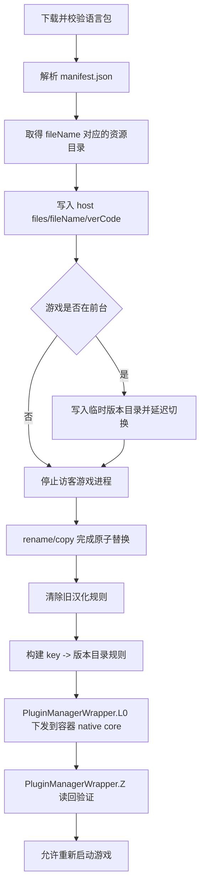

# OurPlay 商业容器汉化方案实测

本文记录 OurPlay 对 Limbus Company 的汉化实现,作为本项目后续调整
VirtualApp 文件视图和汉化安装管线的参考。本文只记录已经静态分析或在测试机上
验证过的事实,并将推断和未知项单独列出。

## 结论摘要

OurPlay 没有修改 Limbus APK,也没有开启 Android 版游戏中被禁用的官方汉化加载器。
它采用以下组合方案:

1. 原样复制 Google Play 安装的 `base.apk` 和 split APK,保留官方签名与文件哈希。
2. 从 OurPlay 服务下载独立的、版本化的 Limbus 中文 JSON 资源包。
3. 将资源安装到 OurPlay 宿主私有目录,不覆盖官方 APK 或游戏已下载资源。
4. 通过容器原生接口把版本目录作为 `path_type_dir_vm` 的 `key` 下发给汉化引擎。
5. 宿主冷启动时 native/DBT 层批量读取该目录,建立 Limbus 文本索引并加载中文字体;
   游戏运行时在 Unity/IL2CPP 文本取得和 UI 赋值路径替换返回字符串。
6. 切换汉化版本前停止或延迟前台游戏,使用临时目录和 rename 完成原子切换。
7. 恢复原文时清除汉化规则,而不是把游戏文件逐个改回去。

设备实测还表明,OurPlay 同时提供了较完整的访客环境视图。外部 root 能看到
OurPlay 容器库和宿主路径,但游戏内 AppSealing 没有因此终止。该兼容层是容器运行
Limbus 的前提,不是语言包本身的一部分。

## 分析范围和版本

本轮结论来自两组材料:

- Java/Kotlin 静态分析:OurPlay 8.5.3 APK,包名 `com.excean.splay`。
- 设备运行时与 native 静态分析:OurPlay 8.5.9.2,versionCode `11022`。
- 目标游戏:Limbus Company 1.109.1,versionCode `450`。
- Limbus 中文资源包:已完整分析 `1497`,设备还下载了 `1500`。
- 测试环境:Redmi/Android 12,root 仅用于只读采集。

8.5.3 的静态结构与 8.5.9.2 的运行时、manifest 表现一致。本文中的 Java 类名和
native 方法声明来自 8.5.3,8.5.9.2 只确认了对应运行时行为,没有完整恢复新版 Java
调用链。后续升级 OurPlay 或 Limbus 后仍需重新验证,不要把本文记录的版本号当作
长期常量。

## 容器进程模型

当前 OurPlay 包名是 `com.excean.splay`;旧版资料中出现过
`com.excean.gspace`,不能再用旧包名定位当前设备数据。

APK manifest 和设备运行时共同确认了以下结构:

- 宿主 UI 进程:`com.excean.splay`。
- 容器管理进程:`com.excean.splay:lbcore`。
- 多组 `ActivityProxy`、`ServiceProxy`、`ContentProviderProxy` 和
  `ReceiverProxy` stub,按 `P00`、`P01` 等槽位运行访客应用。
- Limbus 前台任务实际是
  `com.excelliance.kxqp.platform.proxy.gameplugin.ActivityProxyL$P00`。
- 游戏进程名仍显示为 `com.ProjectMoon.LimbusCompany`,但进程 UID 是 OurPlay
  宿主 UID,说明它不是回退到系统直接启动的真实游戏进程。
- 容器安装记录位于 `gameplugins/<packageName>` 一类目录;Google Play APK
  副本位于 OurPlay 私有 `GOOGLE_MARKET/download/...` 目录。

## 官方 APK 保持不变

Limbus 1.109.1 的真实系统安装包含:

```text
base.apk
split_config.arm64_v8a.apk
split_UnityDataAssetPack.apk
```

设备上逐个比较系统安装源和 OurPlay 私有副本,三个文件的 SHA-256 均完全相同:

| 文件 | SHA-256 |
| --- | --- |
| `base.apk` | `8d85e8fcf67e2ab14ee05a5f17f0e3b007460a536caa4d4a206bc848a53eabeb` |
| `split_config.arm64_v8a.apk` | `5771eaadbaf067b813891412f284fd54fbd47d4eb92857aca5193140056b4504` |
| `split_UnityDataAssetPack.apk` | `7786e7d6078fda09bfa3faf93ab8c842a4969ef04718f9f8c7d6402817c3ff74` |

这些值只用于证明本次实测的两套文件相同,不能作为未来版本的固定校验值。

因此 OurPlay 至少满足以下静态校验条件:

- APK 内容没有被二次打包。
- 官方签名没有变化。
- base/split 集合和 Unity asset pack 保持完整。
- `libcovault-appsec.so` 等游戏原生保护库来自官方 split。

这也是本项目必须继续坚持“同步官方 split,禁止修改游戏 APK”的原因。

## 语言包获取和数据模型

静态分析确认语言信息请求使用
`ResponseRemoteAppLanguageInfo`,包含:

- `packageName`
- `type`
- `versionCode`
- `name`
- `url` / `backupUrl`
- `md5`
- `size`
- `isZip`
- `isForce`
- `clearLocalFile`
- `diff.oldVer` / `diff.newVer` / diff URL、MD5 和大小
- 可选的 `realtimeTranslate` / `realtimeTranslateLog`

APK 中可见的语言包接口包括
`apiservice/game/zh/translatefile` 和 `/depends/zhapk`。这些只是静态发现的接口名;
本项目不得复制 OurPlay 的账号、token、设备标识或直接依赖其私有服务。

下载管理类 `com.excelliance.kxqp.gs.gamelanguage.r` 的职责包括:

1. 根据完整包或 diff 信息创建下载任务。
2. 下载后校验 MD5。
3. 解压语言包并读取 `manifest.json`。
4. 检查旧版本和新版本,必要时应用增量包。
5. 将解析结果交给 `CopyLanguageFileInterceptor` 安装。
6. 记录当前版本、待重试版本和是否需要重启游戏。

## Limbus 1497/1500 语言包实测

中文资源安装目录为:

```text
/data/user/0/com.excean.splay/files/
└── com.ProjectMoon.LimbusCompany/
    └── 1497/
        ├── manifest.json
        ├── custom_font
        ├── 00a7b1690e89f5db29ab32effd185c09
        ├── 00d86bae075a1ddf49a2f1265accec54
        └── ...
```

1497 目录约 29 MiB,共 2075 个文件。除 `manifest.json`、`custom_font` 和一个
二进制数据库外,共有 2072 个可解析 JSON:2066 个普通 UTF-8 JSON,另有 6 个使用
16 字节零头、字符数和 UTF-16LE payload 的包装格式。1500 共 2077 个文件,相对
1497 删除 2 个哈希文件、新增 4 个并修改 10 个共同文件;`custom_font` 完全相同。

JSON 不只是官方 `Localize/en` 文件的改名副本。内容包括:

- 与官方文件近一一对应的 `dataList` 文本表。
- 2834 条以上的合并战斗对白索引。
- 647 条、根节点为 `assetData` 的角色/立绘元数据表。
- BGM、解锁条件等不一定能在当前官方英文目录找到的一组辅助表。

以 1497 对当前官方英文目录按 `id` 和稳定元数据匹配,2072 个 JSON 中有 1961 个
可唯一映射、99 个存在候选歧义、12 个因版本差异或特殊表无法直接映射。这说明哈希
文件名只是 OurPlay 的内部资源键;native 层需要先解析目录,不能把哈希名直接拼成
官方资源路径。

`custom_font` 已确认是 UnityFS AssetBundle,包含 1 个 `Font`、1 个 `Material` 和
1 个 `Texture2D`;bundle 内资源路径为 `assets/fonts/custom_font.ttf`,字体名为
`Sarasa Gothic SC SemiBold`,构建版本标识为 `6000.3.16f1`。它不是简单放到系统
字体目录的 TTF。

实测 `manifest.json` 为:

```json
{
  "files": [
    {
      "md5": "0",
      "size": 0,
      "taregtFileName": "com.ProjectMoon.LimbusCompany",
      "targetPath": "files/com.ProjectMoon.LimbusCompany",
      "targetPathType": "path_type_dir_vm"
    }
  ],
  "pkg": "com.ProjectMoon.LimbusCompany",
  "type": "chinese",
  "verCode": 1497,
  "apkCode": 0,
  "mark": ""
}
```

`taregtFileName` 是 OurPlay manifest 中实际存在的拼写,不是本文笔误。

这个 manifest 没有列出两千多个目标文件,而是把整个
`com.ProjectMoon.LimbusCompany` 目录作为一个 `path_type_dir_vm` 单元交给
容器原生层。这里的“目录规则”是汉化引擎输入目录,不是“把该目录伪装成某个
`Localize/en` 目录”的证据。

## OurPlay 支持的安装类型

`LanguageParseInfo.SingleLanguageFileInfo` 接受以下 `targetPathType`:

| 类型 | 静态分析得到的行为 |
| --- | --- |
| `path_type_data_data` | 复制单文件到访客内部 data 目录 |
| `path_type_android_data` | 复制单文件到访客 Android/data 目录 |
| `path_type_data_data_dir` | 复制目录到访客内部 data 目录 |
| `path_type_android_dir` | 复制目录到访客 Android/data 目录 |
| `path_type_data_vm` | 将单文件放入宿主私有目录并设置 VM 路径规则 |
| `path_type_dir_vm` | 将版本化目录作为 `key` 交给 VM/native 汉化引擎 |
| `path_type_remove_data_data` | 删除访客内部 data 指定目标 |
| `path_type_remove_android_data` | 删除访客 Android/data 指定目标 |

Limbus 1497 实际使用 `path_type_dir_vm`,不是物理覆盖类型。

## `path_type_dir_vm` 安装流程

核心类是
`com.excelliance.kxqp.gs.gamelanguage.CopyLanguageFileInterceptor`。结合反编译代码,
Limbus 的目录安装过程如下:



具体行为:

- 正式目录形如 `context.getFilesDir()/fileName/verCode`。
- 游戏前台运行且目标版本已存在时,先使用 `_temp` 目录,避免运行中看到半套资源。
- 切换前调用容器进程管理接口停止目标包。
- 使用 rename 完成目录切换;rename 失败时回退到 copy 后删除临时目录。
- 规则 map 对 `path_type_dir_vm` 使用特殊键 `key`,值为当前版本目录。
- 如果游戏或语言切换 Activity 正在前台,记录待安装版本并延迟下发规则。
- 下发失败会立即重试,仍失败则保留待重试版本。
- 清理旧版本时保留当前版本和最近可用版本,删除更老目录。

代码还会把 `targetPath` 传给一个受保护的 native 方法以解析已有规则。结合冷启动
批量读取证据,该规则至少负责选择并加载一套语言资源;不能再把它描述为已确认的
访客文件路径前缀映射。

## 汉化规则接口

Kotlin 类 `so.k` 由 `ChinesizationUtils.kt` 编译而来。它负责管理每个游戏的汉化
规则:

```text
set:   pm.z().L0(0, packageName, ruleMap)
read:  pm.z().Z(0, packageName)
clear: 读取旧 map,清空汉化键,保留非汉化配置,再调用 L0
```

`pm` 是 `PluginManagerWrapperBase` 的混淆类名。`L0` 和 `Z` 都是 native 方法,
说明最终规则存储和文件访问改写位于容器 native core,不是 Java 层简单复制。

设置规则后,OurPlay 会立刻读回 map。若输入包含 `key` 而读回结果没有 `key`,会记录
异常并把本次设置视为可疑结果。

同一 rule map 还允许保存以下可选字段:

```text
trans_text_server_path
onoff_trans_server
onoff_trans_log
onoff_collect_text
save_text_path
last_save_text
```

这些字段属于实时翻译或文本采集能力,不能与 Limbus 的文件资源汉化混为一谈。
本次运行时的对应缓存文件为:

```text
/storage/emulated/0/Android/data/com.excean.splay/files/trans_cache/com.ProjectMoon.LimbusCompany.txt
```

该文件大小为 0,而登录界面已经完整显示中文。因此 Limbus 当前不依赖联网逐句翻译
或 OCR;但预下载 JSON 的生效路径确实包含 Unity UI/文本方法 hook,不能再把“UI hook”
与“预下载资源”错误地视为互斥方案。

## 游戏运行时证据

Limbus 1.109.1 在 OurPlay 中运行时:

- 前台仍是 OurPlay `ActivityProxyL$P00`。
- 窗口标题和内部 Activity 仍表现为 Limbus。
- 游戏进程加载官方 `libunity.so`、`libil2cpp.so`、
  `libcovault-appsec.so` 等库。
- 同时加载 OurPlay `libkxqpplatform.so`、`libzmvmpcls.so`、
  `libkxqpzmvmpinf.so` 和 `libappcls.so`。
- 登录页的 Google、Apple、游客登录和清缓存文本均为中文。
- `/proc/<pid>/mountinfo` 没有 Limbus 汉化目录的 bind mount。
- 宿主冷启动期间,`inotifyd` 观察到 1497 目录约 4153 条 open/close 事件,与目录内
  约 2075 个文件被完整批量扫描相符;`custom_font` 也有明确 open/close 事件。
- 访客游戏单独重启而 OurPlay 宿主常驻时没有重新读取,说明解析结果缓存在宿主/native
  规则状态中,不是游戏每显示一句文本就重新打开对应哈希文件。
- 1500 目录已下载,偏好配置中的当前语言版本也为 1500,但本次监控仍观察到 1497
  被读取。Java 版本字段不能替代 native 规则 `set -> read-back` 的真实激活验证。

当前 `libkxqpplatform.so` 的固定操作名进一步给出实现面证据:

```text
getstring_by_obj      getstring_by_res      getstring_by_par
tmp_text_get_text     ui_text_get_text      ui_text_set_text
uitext_onenable       TMP_SetCharArray      TMP_SetText_Builder
TMP_set_font_hook     Text_set_font_hook    TMP_get_font
AssetBundle_Load      custom_tmp_font       custom_text_font
```

这些操作名、批量读取时序和语言包中的合并索引共同表明:OurPlay 先把版本目录解析成
文本数据库,再覆盖 Unity/IL2CPP 的字符串取得、TMP/UI Text 赋值和字体路径。文件 API/
direct syscall 兼容仍用于容器与 AppSealing,但不是 Limbus 汉化文本替换本身。

## 与 AppSealing 校验的关系

汉化能运行不只取决于目录重定向。AppSealing 会检查 APK、包信息、路径和 native
运行环境;OurPlay 还必须让容器化执行对游戏保持透明。

### 已确认事实

- 官方 base/split APK 与 OurPlay 副本逐字节相同。
- 外部 root 查看游戏进程 maps 时,能同时看到 `libcovault-appsec.so` 和 OurPlay
  容器库。
- 游戏正常停留在中文登录页,没有出现本项目曾遇到的 50040/50048 终止。
- 当前 `libkxqpplatform.so` 包含 `/proc/self/maps`、`/proc/%d/maps`、
  `getFakeMaps reverse`、`fidbt_redirect_sys`、`fstatat reverse`、
  `readlinkat`、`openat`、`statx` 和 `syscall` 等实现痕迹。
- 该库保存了多组 libc 文件 API 原函数指针,并有多处打开、读取和解析
  `/proc/self/maps` 的代码。

### 高置信推断

OurPlay 的 native/DBT 层会区分宿主真实视图和访客进程视图。AppSealing 在游戏内通过
libc 或 direct syscall 读取 `/proc/self/maps`、`/proc/self/fd` 和相关路径时,获得的是
经过容器规范化的 guest 视图;外部 root 仍能看到真实宿主映射。

这能解释为什么容器库实际存在于进程中,但 AppSealing 没有按本项目早期容器状态触发
终止。它也解释了为什么只 hook libc 不足以复现 OurPlay:保护代码可以直接调用
`syscall(__NR_openat)`、`readlinkat`、`fstatat` 或 `statx`。

### 尚未确认

- AppSealing 是否另外对 OurPlay 或其签名存在商业兼容白名单。
- `getFakeMaps` 对每一行 maps 的确切过滤条件。
- Limbus 1.109.1 每个 AppSealing 审计调用点最终命中了 OurPlay 哪个 native 分支。
- 1497 与已下载 1500 在 native 规则 read-back 中的确切激活状态,以及 Java 当前版本
  为 1500 时冷启动仍扫描 1497 的失败回滚条件。
- Limbus 每一种文本表分别命中 `getstring_by_obj/res/par` 或 UI setter 中的哪条分支。
- OurPlay 是否对 `libil2cpp` 代码读取也提供未被外部 maps 观察到的 DBT 视图。

因此后续不得直接照猜测实现“删除所有可疑 maps 行”。仍应遵守 `AGENTS.md` 的约束,
按运行时调用点和反汇编证据缩小行为范围。

## 对本项目的改造含义

当前项目的安装模型以容器 `Localize/en` 和逐文件 redirect manifest 为中心。该方案
已验证无效,原因与现有一次性 PID gate 的时序一致:登录/校验后再注册文件重定向时,
官方英文 JSON 已经进入游戏内存;而启动前替换官方路径又会扩大 AppSealing 校验面。
下一阶段应保留现有容器安全边界,但把汉化数据面改为独立的内存文本索引。

### 1. 官方安装集保持原样

- 继续同步系统 Google Play 的 base/split APK。
- 导入前后记录每个 APK 的哈希和签名摘要。
- 更新时只替换 APK 源和 native library,不得清除容器游戏数据。
- 不 patch APK、IL2CPP、`CustomLocalizeManager.IsRunning()` 或 AppSealing 库。

### 2. 版本化语言资源仓库

- 将下载、校验、解压后的语言资源保存到汉化器宿主私有目录。
- 目录至少按 `packageName/versionCode` 隔离。
- 使用 staging/temporary 目录,完整校验后再 rename 为正式版本。
- 保留当前版本和一个回滚版本,清理更老版本。
- 激活规则只引用不可变的正式版本目录。

### 3. 启动前文本索引

- 不复用 OurPlay 哈希文件名或私有协议。本项目继续读取已有上游
  `LimbusLocalize_<version>.7z`,当前生产模式只把同路径官方日文和中文 JSON 编译为
  自己的轻量 UI 索引。
- 第一层键为原文字符串;原文唯一时允许直接替换。重复原文原样返回,不再构建或加载
  文件/字段/ID 上下文索引。
- 索引必须保存版本、输入 SHA-256、条目数和冲突数,写入 staging 后原子 rename。
- native 规则绑定 virtual user、包名和当前 vpid,支持 set/read-back/clear。恢复原文只
  清除当前索引,不修改官方 JSON。
- 结构化配对仍只读取显式显示文本白名单;`id` 仅用于离线对齐日文与中文行,不写入
  runtime index。模型、语音、图标和 usage 等元数据不进入文本索引。

### 4. Unity/IL2CPP hook 面

- 当前 Limbus `libil2cpp.so` 公开
  `il2cpp_domain_get`、`il2cpp_domain_get_assemblies`、`il2cpp_assembly_get_image`、
  `il2cpp_class_from_name`、`il2cpp_class_get_method_from_name`、`il2cpp_string_new` 等
  API。hook 应按程序集/类/方法名解析,不得把函数 RVA 当长期常量。
- 第一阶段只处理 `TMPro.TMP_Text.set_text` 和 `UnityEngine.UI.Text.set_text`,命中唯一
  原文索引才替换;同时记录匿名统计,不得记录完整用户文本。
- TMP setter 只是最终 UI fallback。完整模式必须同时覆盖故事和
  `TextData_*`/参数格式化等字符串取得路径,对应实测 OurPlay 的
  `getstring_by_obj/res/par` 分层;否则只能汉化静态 UI。
- 不 patch `CustomLocalizeManager.IsRunning()`、游戏 APK、global metadata 或
  AppSealing 库;不使用 Frida。

### 5. 中文字体

- 语言版本中保存经校验的 Unity AssetBundle 或项目自有等价 bundle,不向系统字体
  目录写文件。
- 启动后通过 Unity API 加载 legacy `Font`,为 `UI.Text` 设置中文字体;再通过
  `TMP_FontAsset.CreateFontAsset` 建立动态 TMP 字体并挂到 `TMP_Text`。
- 字体替换只在待显示字符串确实命中中文索引,或原字体缺少对应 glyph 时发生;保留
  原材质、字号、fallback 和对象生命周期。
- bundle 的 Unity 版本必须与当前游戏兼容;失败时熔断文本替换,避免出现中文方框。

### 6. 校验阶段与汉化激活

- 优先保持官方 APK、split、签名和游戏原始资源不变。
- 只隐藏容器实现细节,不能泛化伪造系统模块、未知 syscall 或游戏自身内存映射。
- 对 `/proc/self/maps` 等审计路径先增加有限调用点日志,确认 Limbus 版本和 callsite
  后再实现最小 guest 视图。
- 新索引和 hook 必须在访客进程创建后、首批 UI 文本产生前就绪;不再依赖登录后手工
  打开逐文件规则。
- 当前工程已有 Substrate/And64InlineHook,但 inline patch `libil2cpp` 可能增加完整性
  校验风险。第一版必须只挂最少方法、校验方法签名并带全局熔断;若出现 50040/50048
  或代码完整性异常,不得扩大 maps 伪装,应回退并重新选取更窄入口。

## 建议实施顺序

1. 增加离线 `TranslationIndexCompiler`,从同路径日文/中文 JSON 生成唯一原文索引和
   版本 manifest;冲突只计数并排除。
2. 将索引和字体 bundle 写入不可变的 `package/version` 目录,实现 staging、原子激活、
   read-back 和回滚。
3. 增加只读 IL2CPP resolver,在测试构建中打印目标程序集、类、方法签名和方法地址,
   暂不安装 hook。
4. 只 hook `TMP_Text.set_text`,使用很小的内置测试索引验证标题页单条文本替换和熔断。
5. 加载中文字体并验证 glyph、材质和场景切换生命周期;字体未成功时禁止中文替换。
6. 在日语模式下逐步接入经方法签名确认的字符串取得路径,并保留 TMP UI setter 作为
   fallback;分别验证登录页、人物/技能、战斗和剧情,统计命中、冲突和未命中数量。
8. 删除或下线无效的登录后逐文件 PID gate 生产入口;保留诊断导出能力。
9. 最后才处理经 backtrace 确认的 `/proc` guest 视图差异,不得为文本 hook 泛化隐藏。

## 验收标准

- 容器内游戏版本和三个官方 APK 哈希与宿主安装源一致。
- 未激活规则时游戏保持官方文本;激活后显示指定汉化版本,且官方 JSON 未改变。
- 切换过程中不会看到半套资源,失败可回滚到上一个版本。
- 恢复原文只清除规则,不重新下载游戏资源。
- 游戏更新后重同步 APK 不会删除语言资源仓库或游戏数据。
- 索引构建报告列出唯一映射和冲突数量;冲突项不会误替换。
- 字体加载失败时不输出中文方框,而是整套汉化熔断回退原文。
- 标题、主页面、战斗、剧情分别有运行时命中证据,并覆盖 TMP 普通赋值和打字机路径。
- `pidof`、Activity 栈和 UID 证明游戏始终从 VirtualApp 启动。
- AppSealing 不出现 50040/50048,同步内存错误和真实信号仍按原 handler 处理。
- 日志中不包含 token、账号或私有下载凭据。

## 边界

本文用于理解商业容器的工程方法,不是要求复制 OurPlay 的私有协议或受保护 native
实现。本项目只复用可验证的架构思想:官方 APK 不变、版本化资源、启动前批量索引、
Unity 文本/字体窄 hook、原子规则切换和可回滚。所有实现仍必须遵守 `AGENTS.md`
中禁止修改游戏 APK、禁止 Frida、限制 AppSealing 特判范围等约束。
