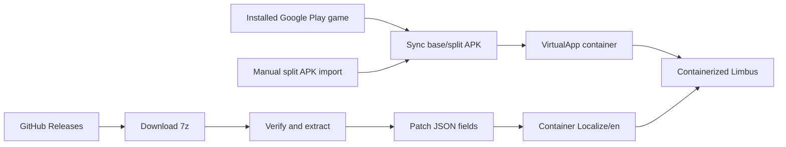

# Project Architecture Notes

This document keeps the longer project background out of `AGENTS.md`.

## Overview

The app is an Android Chinese-localization companion for `com.ProjectMoon.LimbusCompany`.
The production path is container mode:

1. Import or synchronize the Google Play installed Limbus split APKs.
2. Launch the game inside VirtualApp.
3. Keep host packages, tools, and the localizer package hidden from normal game queries.
4. Write translation files into the container-visible game data directory.

The project does not modify the game APK and does not rely on Frida or Shizuku.

## Modules

- `:app`: Kotlin / Jetpack Compose UI and localization workflow.
- `:virtualapp`: vendored VirtualApp Android 12 source under `third_party/virtualapp-upstream/lib`.
- `container`: runtime boundary for import, launch, storage, and patch installation.
- `gamefs`: `GameStorage` abstraction for container data access.
- `update`: GitHub Releases discovery, hash checking, `.7z` extraction, and patch cache manifest generation.
- `DeviceCompatibility`: Android 8+/arm64/page-size/low-RAM/background-policy inspection and verified OEM settings fallback.
- `PersistentDiagnosticLog` / `DebugLogExporter`: per-process bounded logs, uncaught exception capture, redaction, exit reasons, and Issue ZIP generation.

## Runtime Flow



## Container Data Preservation

After the game reaches the post-login resource download flow, the VirtualApp
game data/storage directories are treated as durable state. They may contain
the downloaded Limbus resources, which are large enough that clearing the
container forces a full re-download.

Resynchronizing the Google Play install must therefore update only the imported
APK/split sources and native libraries. Do not uninstall
`com.ProjectMoon.LimbusCompany`, clear its VirtualApp data directory, or remove
its virtual external storage as part of routine sync or launch repair.

Limbus typically updates from Google Play every Thursday. After the host game is
updated, use the installed-game sync path to re-import the current host
`base.apk` and split APKs into the container while preserving container data.

Game launch should treat synchronization as an automatic guard rather than a
normal user-facing step:

- If the container has no imported game record, copy the host Google Play
  install, import it into VirtualApp, then launch.
- If the host Google Play version differs from the recorded container version,
  re-import the host APK/splits, then launch.
- If the versions match, skip copying/importing and launch directly.
- If the VirtualApp package cache is missing while the workspace record still
  exists, `launchGame()` may repair the package cache from the stored APK copy,
  but it must still preserve game data and downloaded resources.

## Important Paths

Container-visible localization root:

```text
/sdcard/Android/data/com.ProjectMoon.LimbusCompany/files/Assets/Resources_moved/Localize/
├── RemoteLocalizeFileList.json
├── localize_en.zip
├── en/
├── jp/
├── kr/
├── etc/VoiceTable.json
└── Temp/LocalizeTemp_en/LocalizeTemp_en/
```

The game text files are downloaded only after login reaches the main flow, so the directory can be empty during title/login debugging.

## Patch Rules

Only explicit display-text fields may be changed. The current whitelist covers
ordinary copy, dialogue, names and descriptions, including `content`, `dialog`,
`dlg`, `teller`, `name`, `nameWithTitle`, `desc`, `description`, `title`,
`summary`, `flavor`, and `place`, plus the additional display-only fields listed
in `ContainerPatchInstaller.TEXT_FIELDS`. Do not change metadata fields such as
`id`, `personalityid`, `voicefile`, `usage`, `model`, or icon/resource keys.

## Localization Preparation

Once the game has entered the post-login main flow and downloaded
`Localize/en`, use the debug snapshot exporter to copy a read-only archive of
the container-visible Localize tree into the localizer app's own external files
directory:

```powershell
adb -s <device> shell am start -n com.example.limbuszhcn/.MainActivity --ez export_localize_snapshot true
adb -s <device> shell ls /sdcard/Android/data/com.example.limbuszhcn/files/diagnostics/localize-snapshots
adb -s <device> pull /sdcard/Android/data/com.example.limbuszhcn/files/diagnostics/localize-snapshots/<snapshot>.zip .diagnostics/
```

The exporter does not modify game resources. It only reads the VirtualApp
Localize root and writes a zip plus a small summary file.

After pulling the snapshot, prepare a translation catalog on the workstation:

```powershell
python .\scripts\localize_catalog.py export `
  --input .\.diagnostics\<snapshot>.zip `
  --output .\.diagnostics\localize-catalog.jsonl `
  --summary .\.diagnostics\localize-catalog-summary.json
```

Each JSONL row contains `path`, `index`, `id`, `field`, `source`, and an empty
`translation`. Only fill `translation`; keep `path`, `index`, `id`, and `field`
stable so the apply step can patch the original JSON safely.

To build a patch directory from a translated catalog:

```powershell
python .\scripts\localize_catalog.py apply `
  --input .\.diagnostics\<snapshot>.zip `
  --catalog .\.diagnostics\localize-catalog.translated.jsonl `
  --output-dir .\.diagnostics\prepared-patch
```

The generated patch directory is shaped as `files/en/...` and only contains
JSON files whose allowed text fields changed.

## Translation Download Source

GitHub Releases is the only supported translation-package source. The default
URL is `https://github.com/LocalizeLimbusCompany/LocalizeLimbusCompany/releases`.
The app maps this to GitHub's release API, reads the newest release from
`releases?per_page=1`, and selects `LimbusLocalize_<tag>.7z` from that release's
assets. It verifies the archive when GitHub publishes a SHA-256 digest, extracts
the patch-cache layout, and activates the runtime index through `GameStorage`.

The production path must not accept relay endpoints, access tokens, or arbitrary
download services. Do not pin it to a single tag such as `2026071001`; that tag
is only useful as a known-good format sample.

## Installation Strategy

The preferred experiment path is runtime file-read redirection. Installing a
translation package downloads and extracts `LimbusLocalize_<version>.7z` into
the localizer cache, then writes an active redirect manifest mapping each
container-visible original JSON file to a merged JSON file in
`runtime-redirect-cache`.

The manifest is prepared before launch, but redirect rules stay disabled during
login and resource validation. Every game launch removes the previous one-shot
gate. After validation completes, a debug action writes the current virtual
process pid to `translation-cache/redirect-gate.pid`; only that process may
consume the gate and register `NativeEngine.redirectFile()` rules at runtime.
This prevents a stale global switch from changing files seen by the next
validation pass.

```powershell
adb -s <device> shell am start -n com.example.limbuszhcn/.MainActivity --ez refresh_translation_redirects true
adb -s <device> shell am start -n com.example.limbuszhcn/.MainActivity --ez launch_container_game true
# Run only after resource validation completes:
adb -s <device> shell am start -n com.example.limbuszhcn/.MainActivity --ez enable_translation_redirects true
```

This keeps the downloaded game `Localize/en` files unchanged. "Restore" for a
redirect install disables the active redirect manifest. The older overwrite
installer remains available internally as a fallback and still saves a baseline
before modifying files.

Because translated files can live outside the game's visible resource tree,
`Localize/en` probing is a diagnostic tool rather than a normal user workflow.

## Runtime Translation Index

The file redirect experiment proved that enabling redirects after login is too
late: the official localization tables have already been loaded into the game.
The replacement data path is therefore a versioned, host-private text index.

The production path is a Japanese-only full text takeover modeled on the observed
OurPlay pipeline. During translation activation, `ContainerPatchInstaller`
recursively pairs the translated JSON with the container-visible official Japanese
JSON. Stable `id` values are preferred for array alignment, while matching nested
arrays such as skill levels and coin descriptions are traversed structurally. Only
explicitly whitelisted display fields enter the runtime index. Ambiguous source
strings are counted and excluded from the context-free fallback. Schema 8 also
stores a curated short-term table for longest-match replacement inside formatted
or rich text. Dominant conflicts are accepted only with at least three samples,
80% support and a 3x lead over the runner-up. Paired square brackets and TMP rich
text tags are removed when deriving terms, so sources such as `[攻撃前]` and
`<color><s>長姉</s></color>` also cover their embedded runtime forms.
Runtime longest-match replacement copies complete `<...>` TMP tags without
inspection and requires word boundaries around ASCII-only terms. Schema 8 keeps
expanding package terms such as `以上 -> 或以上`, while the native matcher detects
whether a source occurrence is already inside the complete translated value. This
makes repeated `SkillPerLevel -> Skill -> TMP` passes idempotent without discarding
verified translations from the downloaded package.
The compiler and native object-graph traversal use the same explicit display-field
policy. In addition to the original skill/UI fields, schema 8 includes verified
display values such as `story`, `relatedChapterText`, and `openConditionNumber`.
Translations containing Unicode replacement characters or illegal control bytes
are omitted so a damaged package entry leaves the official Japanese text intact.

TMP text assignment is the final UI fallback, not the complete translation path.
Character, identity, skill and story text must also be intercepted while the game
obtains or formats strings from `TextData_*` and related localization objects. This
keeps the index Japanese-only without reducing coverage to static UI labels.
The native layer enumerates every runtime class whose name starts with
`TextData_`, then hooks string-returning formatters with one or two parameters
only when the method has at least 16 bytes before the next method body. On Limbus
1.109.1 this discovered 59 classes and safely installed 54 one-argument plus four
two-argument formatters, covering UI, passive, abnormality event, EGO gift,
mirror/railway, quest, lyrics and Dante-note text without a page-level whitelist.
Before the per-level skill formatter runs, it also traverses the whitelisted
`levelList`, `coinlist` and `coindescs` graph through reflected `List<T>` methods;
no managed list or array offsets are hard-coded.
Direct short getters are intentionally left to exact TMP/UI replacement because
the legacy ARM64 inline-hook prologue is wider than several adjacent getter bodies.
For Dante-note paragraphs, the game inserts `line-height` tags around newline
boundaries after localization lookup. An exact miss may retry after removing only
those layout tags; a successful translation reapplies the same 170%/100% paragraph
spacing to Chinese newlines. Color, sprite, link and style markup is never removed
by this normalization.

### Launcher workflow and resource readiness

The ordinary launcher path is a single `Launch translated game` action. It first
checks GitHub Releases, reuses a hash-validated archive when possible, synchronizes
the installed game only when needed, activates a complete index, and then launches
the guest. The GitHub Releases URL remains an advanced setting so forks can point
to their own public release repository without introducing credentials.

Package freshness, Japanese-resource readiness, and active-index state are
separate. A fresh game install or game update may not have downloaded its
`jp/JP_*.json` resources yet. Index compilation counts candidate translation JSON
files and readable Japanese counterparts. Fewer than 90 percent available sources
is a resource-preparation state: the package remains cached, any prior valid index
remains active, and no partial index or misleading active marker is written. The
game is launched so it can download resources after login. On the next launcher
run, the cached package is paired with the newly available sources and activated.
An individual exact-match miss remains Japanese and does not invalidate the rest
of the index.

### User diagnostics export

The advanced launcher panel exposes a user-initiated ZIP diagnostics export. It
contains a human-readable runtime summary, recent logcat lines visible to the
host UID, historical process-exit reasons, and the active translation-index
manifest. This covers the host and VirtualApp guest processes because they share
the application UID, without requesting privileged device-wide log access.

Diagnostics are intentionally metadata-only. The exporter must not include
translation JSON, game saves, PlayerPrefs, updater configuration, account data, or
arbitrary container files. Before writing the archive it redacts authorization
headers, token-like fields, URL credentials, email addresses, and JWT-shaped
values. Each collected stream and the final archive are bounded so a runaway log
cannot exhaust storage. Android's document picker owns the final destination;
temporary archives remain in the application cache and are replaced on the next
export.

### Bundled microG bootstrap

The production application packages the exact microG Services and Companion
APKs already validated by the container login flow. A bundled properties
manifest pins each asset's package name, version code, SHA-256 digest and signing
certificate digest. Assets exceeding a source-hosting single-file limit are split
into ordered manifest-declared parts. On a fresh install, `MicrogContainerConfig`
concatenates those parts into host-private staging, verifies the complete APK byte
digest before publishing the staged set, and lets the existing VirtualApp
installation path validate package identity and install native libraries. No
network or debug intent is required.

Legacy devices with a complete externally staged set keep using it so an
application update does not unexpectedly replace a working login environment.
Fresh devices and devices whose bundled staging is incomplete rebuild from the
signed outer APK assets. Debug-only path/URL overrides remain available for
development, but are not part of the user workflow. The embedded Apache-2.0
license and component provenance are shipped alongside the APK assets.

This mode supports Japanese only. Immediately after the original `il2cpp_init`
returns, the runtime resolves `GlobalGameManager.get_Lang()` and forces its
runtime return value to `JP=2`; `LocalSave.LocalGameOptionData.GetLanguage()` is
retained only as a compatibility hook. Device validation must show an actual
language-getter hit because a successful hook-install log alone does not prove
that the game selected Japanese. The PlayerPrefs XML is not rewritten, so its
encryption key, IV and other user settings remain untouched. Japanese layout/font
materials stay active; the dynamic Chinese TMP fallback remains available for
missing glyphs.

Each compiled version is immutable:

```text
translation-cache/translation-index/
├── active-index.path
└── versions/<translation-version>/
    ├── index.bin
    └── manifest.properties
```

The version directory is written through a staging directory and renamed only
after all files are complete. `active-index.path` is then replaced atomically
and contains the absolute path of the selected `index.bin`. Disabling a
translation removes only this active pointer; version directories remain
available for rollback.

The Limbus guest process loads and validates `index.bin`, completes VirtualApp's
libc IO-hook pass, then intercepts the `dlsym("il2cpp_init")` result before Unity
loads the managed runtime. It installs acquisition and TMP hooks only after the original initializer
returns. This has no fixed startup delay, does not patch `il2cpp_init`, and does
not query a half-initialized domain. Exact
source matches are replaced with managed UTF-16 strings. The bundled
`ChineseFont.ttf` (Sarasa Gothic SC Regular, from the official Sarasa Gothic
release) is copied
once to host-private storage, converted to a dynamic 4096x4096 TMP SDF font and
registered in `TMP_Settings.fallbackFontAssets`. It is deliberately not assigned
as every component's primary font. The runtime tags only managed strings that it
creates as translation results. While one of those tagged strings is assigned,
the receiving TMP component temporarily uses the Chinese asset as its primary
font so common Han glyphs and Simplified-Chinese-only glyphs do not alternate
between the Japanese primary face and the fallback. The original font material is
remembered as well: outline width/color are copied onto the per-component Chinese
material so coin-skill text retains the game's black edge, and the exact material
is restored with the original font. Translated text without an explicit
`line-height` tag receives a small line-spacing floor before layout. This also
covers rows created by TMP automatic wrapping; checking only for literal newlines
left long skill descriptions overlapping. Single-line labels are unaffected
because line spacing is consumed only between generated rows. A reused component
is restored to its original font, material,
and spacing as soon as it receives an untagged string. This
must not be generalized to every non-ASCII string. A 1024 atlas caused old glyphs
to disappear after loading a skill screen, so both primary and fallback use the
same 4096x4096 dynamic asset. Font creation failure leaves the original text
unchanged. The fallback is prepared before any non-ASCII TMP text is laid out,
because a formatter may already have returned Chinese before the setter hook
runs; relying only on a setter-time replacement would leave the first such screen
without Chinese-only glyphs.

Translation provenance is retained by exact UTF-8 output content rather than by
the raw IL2CPP object address alone. Limbus can copy a returned string into a new
managed object before assigning it to TMP, and address-only tagging then loses the evidence needed
to select the uniform Chinese primary face. Exact content tracking survives that
copy while still avoiding a blanket font replacement for native Japanese text.
Known, reviewed upstream terminology errors are normalized while the index is
compiled, and a very small built-in term table covers reviewed Japanese condition
fragments that otherwise degrade into half-Japanese output after shorter terms are
substituted.

## Notes

- Shizuku was removed because the game detects visible Shizuku environments.
- Weekly Google Play updates should be handled by resyncing installed split APKs from the host installation, not by asking the user to manually reselect APKs and not by clearing container data.
- `docs/container-runtime-notes.md` contains deeper VirtualApp and device-specific findings.
